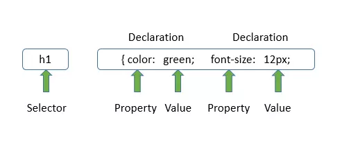

# CSS Basic

## CSS Syntax
A CSS rule consists of a selector and a declaration block.



- The selector points to the HTML element you want to style.
- The declaration block contains one or more declarations separated by semicolons.
- Each declaration includes a CSS property name and a value, separated by a colon.
- Multiple CSS declarations are separated with semicolons, and declaration blocks are surrounded by curly braces.

**Example** <br>
In this example all `<p>` elements will be center-aligned, with a red text color:
```css
p {
  color: red;
  text-align: center;
}
```
Example Explained
* p is a selector in CSS (it points to the HTML element you want to style: `<p>`).
* color is a property, and red is the property value
* text-align is a property, and center is the property value

## CSS Selectors
A CSS selector selects the HTML element(s) you want to style.

CSS selectors are used to "find" (or select) the HTML elements you want to style.

We can divide CSS selectors into five categories:
1. Simple selectors (select elements based on name, id, class)
1. Combinator selectors (select elements based on a specific relationship between them)
1. Pseudo-class selectors (select elements based on a certain state)
1. Pseudo-elements selectors (select and style a part of an element)
1. Attribute selectors (select elements based on an attribute or attribute value)

### The CSS element Selector
The element selector selects HTML elements based on the element name.

**Example**: Here, all `<p>` elements on the page will be center-aligned, with a red text color: 
```css
p {
  text-align: center;
  color: red;
}
```

### The CSS id Selector
The id selector uses the id attribute of an HTML element to select a specific element.

The id of an element is unique within a page, so the id selector is used to select one unique element!

To select an element with a specific id, write a hash (#) character, followed by the id of the element.

**Example**:
The CSS rule below will be applied to the HTML element with id="para1": 

```css
#para1 {
  text-align: center;
  color: red;
}
```

### The CSS class Selector
The class selector selects HTML elements with a specific class attribute.

To select elements with a specific class, write a period (.) character, followed by the class name.

**Example:** In this example all HTML elements with class="center" will be red and center-aligned: 

```css
.center {
  text-align: center;
  color: red;
}
```
You can also specify that only specific HTML elements should be affected by a class.

**Example**: In this example only `<p>` elements with class="center" will be red and center-aligned: 

```css
p.center {
  text-align: center;
  color: red;
}
```

HTML elements can also refer to more than one class.

**Example:** In this example the <p> element will be styled according to class="center" and to class="large": 

```html
<p class="center large">This paragraph refers to two classes.</p>
```

### The CSS Universal Selector
The universal selector (*) selects all HTML elements on the page.

**Example:**
The CSS rule below will affect every HTML element on the page: 

```css
* {
  text-align: center;
  color: blue;
}
```

### The CSS Grouping Selector
The grouping selector selects all the HTML elements with the same style definitions.

Look at the following CSS code (the h1, h2, and p elements have the same style definitions):

```css
h1 {
  text-align: center;
  color: red;
}

h2 {
  text-align: center;
  color: red;
}

p {
  text-align: center;
  color: red;
}
```
It will be better to group the selectors, to minimize the code.

To group selectors, separate each selector with a comma.

**Example:** In this example we have grouped the selectors from the code above: 

```css
h1, h2, p {
  text-align: center;
  color: red;
}
```

## How To Add CSS
When a browser reads a style sheet, it will format the HTML document according to the information in the style sheet.

### Three Ways to Insert CSS
There are three ways of inserting a style sheet:
1. External CSS
1. Internal CSS
1. Inline CSS

#### External CSS
With an external style sheet, you can change the look of an entire website by changing just one file!

Each HTML page must include a reference to the external style sheet file inside the `<link>` element, inside the head section.

**Example:** External styles are defined within the <link> element, inside the <head> section of an HTML page:
```html
<!DOCTYPE html>

<html>
    <head>
        <link rel="stylesheet" href="style.css">
        </head>
    <body>
        <h1>This is a heading</h1>
        <p>This is a paragraph.</p>
    </body>
</html>
```
An external style sheet can be written in any text editor, and must be saved with a .css extension.

The external .css file should not contain any HTML tags.

Here is how the "style.css" file looks:

>"style.css"
>```css
>body {
>  background-color: lightblue;
>}
>
>h1 {
>  color: navy;
>  margin-left: 20px;
>}
>```

$Note:$ $Do$ $not$ $add$ $a$ $space$ $between$ $the$ $property$ $value$ $(20)$ $and$ $the$ $unit$ $(px):$
* Incorrect (space): `margin-left: 20 px;`
* Correct (no space): `margin-left: 20px;`

#### Internal CSS
An internal style sheet may be used if one single HTML page has a unique style.

The internal style is defined inside the `<style>` element, inside the head section.

**Example:** Internal styles are defined within the `<style>` element, inside the <head> section of an HTML page:
```html
<!DOCTYPE html>

<html>
    <head>
        <style>
        body {
        background-color: linen;
        }

        h1 {
        color: maroon;
        margin-left: 40px;
        }
        </style>
    </head>
    <body>
        <h1>This is a heading</h1>
        <p>This is a paragraph.</p>
    </body>
</html>
```

### Inline CSS
An inline style may be used to apply a unique style for a single element.

To use inline styles, add the style attribute to the relevant element. The style attribute can contain any CSS property.

**Example:** Inline styles are defined within the "style" attribute of the relevant element:
```html
<!DOCTYPE html>
<html>
    <body>

        <h1 style="color:blue;text-align:center;">This is a heading</h1>
        <p style="color:red;">This is a paragraph.</p>

    </body>
</html>
```

> Tip: An inline style loses many of the advantages of a style sheet (by mixing content with presentation). Use this method sparingly.

### Multiple Style Sheets
If some properties have been defined for the same selector (element) in different style sheets, the value from the last read style sheet will be used. 

Assume that an external style sheet has the following style for the `<h1>` element:

```css
h1 {
  color: navy;
}
```

Then, assume that an internal style sheet also has the following style for the `<h1>` element:

```css
h1 {
  color: orange;   
}
```

**Example:** If the internal style is defined after the link to the external style sheet, the `<h1>` elements will be "orange":

```html
<head>
    <link rel="stylesheet" type="text/css" href="mystyle.css">
    <style>
        h1 {
        color: orange;
        }
    </style>
</head>
```

**Example:** However, if the internal style is defined before the link to the external style sheet, the `<h1>` elements will be "navy": 
```html
<head>
    <style>
        h1 {
        color: orange;
    }
    </style>
    <link rel="stylesheet" type="text/css" href="mystyle.css">
</head>
```

### Cascading Order
What style will be used when there is more than one style specified for an HTML element?

All the styles in a page will "cascade" into a new "virtual" style sheet by the following rules, where number one has the highest priority:

1. Inline style (inside an HTML element)
1. External and internal style sheets (in the head section)
1. Browser default

So, an inline style has the highest priority, and will override external and internal styles and browser defaults.

## CSS Comments
CSS comments are not displayed in the browser, but they can help document your source code.

Comments are used to explain the code, and may help when you edit the source code at a later date.

Comments are ignored by browsers.

A CSS comment is placed inside the `<style>` element, and starts with /* and ends with */.

## CSS Colors
Colors are specified using predefined color names, or RGB, HEX, HSL, RGBA, HSLA values.

### CSS Color Names
In CSS, a color can be specified by using a predefined color name:


CSS/HTML support 140 standard color names.

### CSS Background Color
You can set the background color for HTML elements:

**Example:**
```html
<h1 style="background-color:DodgerBlue;">Hello World</h1>
<p style="background-color:Tomato;">Lorem ipsum...</p>
```
<h1 style="background-color:DodgerBlue;">Hello World</h1>
<p style="background-color:Tomato;">Lorem ipsum...</p>

### CSS Text Color
You can set the color of text:

**Example:**
```html
<h1 style="color:Tomato;">Hello World</h1>
<p style="color:DodgerBlue;">Lorem ipsum...</p>
<p style="color:MediumSeaGreen;">Ut wisi enim...</p>
```
<h1 style="color:Tomato;">Hello World</h1>
<p style="color:DodgerBlue;">Lorem ipsum...</p>
<p style="color:MediumSeaGreen;">Ut wisi enim...</p>

### CSS Border Color
You can set the color of borders:

**Example:**

<h1 style="border:2px solid Tomato;">Hello World</h1>
<h1 style="border:2px solid DodgerBlue;">Hello World</h1>
<h1 style="border:2px solid Violet;">Hello World</h1>

```html
<h1 style="border:2px solid Tomato;">Hello World</h1>
<h1 style="border:2px solid DodgerBlue;">Hello World</h1>
<h1 style="border:2px solid Violet;">Hello World</h1>
```

### CSS Color Values
In CSS, colors can also be specified using RGB values, HEX values, HSL values, RGBA values, and HSLA values:

Same as color name "Tomato":

```html
<h1 style="background-color:rgb(255, 99, 71);">rgb(255, 99, 71)</h1>
<h1 style="background-color:#ff6347;">#ff6347</h1>
<h1 style="background-color:hsl(9, 100%, 64%);">hsl(9, 100%, 64%)</h1>

<h1 style="background-color:rgba(255, 99, 71, 0.5);">rgba(255, 99, 71, 0.5)</h1>
<h1 style="background-color:hsla(9, 100%, 64%, 0.5);">hsla(9, 100%, 64%, 0.5)</h1>
```
<h1 style="background-color:rgb(255, 99, 71);">rgb(255, 99, 71)</h1>
<h1 style="background-color:#ff6347;">#ff6347</h1>
<h1 style="background-color:hsl(9, 100%, 64%);">hsl(9, 100%, 64%)</h1>

Same as color name "Tomato", but 50% transparent:


<h1 style="background-color:rgba(255, 99, 71, 0.5);">rgba(255, 99, 71, 0.5)</h1>
<h1 style="background-color:hsla(9, 100%, 64%, 0.5);">hsla(9, 100%, 64%, 0.5)</h1>